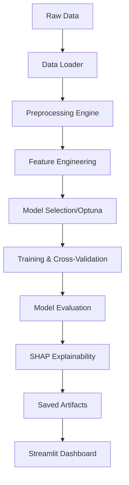

# 🏠 House Price Prediction Project (2026)


[](https://www.python.org/)
[](https://streamlit.io/)
[](https://scikit-learn.org/)
[](https://opensource.org/licenses/MIT)

## 📌 Project Overview
This project is a professional-grade, end-to-end machine learning system designed to predict house prices with high precision. It leverages modern engineering practices, including **Object-Oriented Programming (OOP)**, modular pipeline design, and state-of-the-art gradient boosting algorithms.

Whether you're looking for a baseline linear model or a hyper-optimized CatBoost regressor, this project provides a unified framework to train, evaluate, and deploy models seamlessly.

---

## 🚀 Key Features

*   **🏗️ Modular Architecture**: Fully decoupled modules for data loading, preprocessing, model training, and hyperparameter tuning.
*   **📂 Production-Ready Pipeline**: Automated feature engineering, categorical encoding, and scaling.
*   **🤖 Advanced Model Zoo**:
    *   Linear Regression, Ridge, Lasso
    *   Random Forest
    *   XGBoost, LightGBM, **CatBoost**
*   **🎯 Intelligent Tuning**: Integrated with **Optuna** for Bayesian hyperparameter optimization.
*   **🔍 Model Interpretability**: Global and local explanations powered by **SHAP**.
*   **🌐 Interactive Dashboards**: A premium **Streamlit** application for real-time predictions.

---

## 📁 Project Structure

```text
house_price_prediction/
├── app/                    # Streamlit application & UI components
├── src/                    # Core source code modules
│   ├── data/               # Data ingestion & validation
│   ├── preprocessing/      # Cleaning, Feature Engineering, Scaling
│   ├── models/             # Model definitions, Training, Evaluation
│   ├── tuning/             # Optuna-based search spaces
│   ├── explainability/     # SHAP value generators
│   └── pipeline/           # Orchestration layer
├── data/                   # Data storage (Raw & Processed)
├── models/                 # Serialized model artifacts (.joblib)
├── notebooks/              # Exploratory Data Analysis (EDA)
├── main.py                 # CLI Entry point for training
└── requirements.txt        # Dependency management
```

---

## 🛠️ Installation & Setup

### 1. Clone the repository
```bash
git clone <your-repo-url>
cd house-price-prediction
```

### 2. Create a Virtual Environment
```bash
python -m venv env
source env/bin/activate  # On Windows: .\env\Scripts\activate
```

### 3. Install Dependencies
```bash
pip install -r house_price_prediction/requirements.txt
```

---

## 🚦 How to Use

### 🧬 Training the Pipeline
To trigger the full end-to-end pipeline (Data Loading -> Preprocessing -> Tuning -> Training -> Evaluation -> Saving):
```bash
python house_price_prediction/main.py
```

### 🖥️ Launching the Web App
To start the interactive prediction dashboard:
```bash
streamlit run house_price_prediction/app/streamlit_app.py
```

---

## 📊 Pipeline Workflow



---

## 📈 Evaluation Metrics
The system benchmarks all models across:
*   **MAE**: Mean Absolute Error (Robust to outliers)
*   **RMSE**: Root Mean Squared Error (Higher penalty for large errors)
*   **R² Score**: Variance explanation ratio

---

## 🤝 Contributing
Contributions are welcome! Please feel free to submit a Pull Request.

---

## 📄 License
This project is licensed under the MIT License - see the [LICENSE](LICENSE) file for details.

---
**Developed with ❤️ for the PFAI House Price Prediction Competition.**
